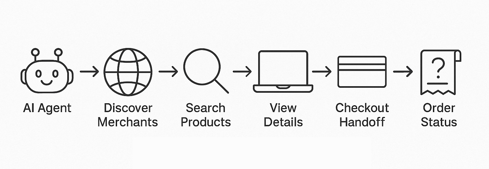
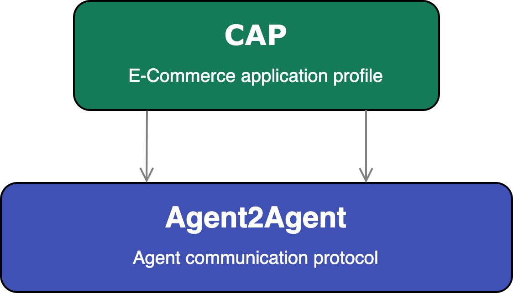

---
hide:
  - navigation
  - toc
---

# Commerce Agent Protocol

## Standardizing AI Agent Interactions for E-commerce

The **Commerce Agent Protocol (CAP)** is an open standard designed to enable personal AI agents to seamlessly discover and interact with compliant merchants for a complete e-commerce purchase flow. By defining a common language and a set of standardized operations, CAP aims to create an open, interoperable ecosystem for AI-driven commerce.

{width="60%"}
{style="text-align: center; margin-bottom:1em; margin-top:2em;"}

---

### Why CAP? The Future of AI-Powered Shopping

CAP empowers AI agents to become capable shopping assistants by addressing key challenges in AI-driven commerce:

- :material-store-search-outline:{ .lg .middle } **Simplified Merchant Discovery**

    Provides a consistent mechanism for AI agents to find CAP-compliant merchants and understand their e-commerce capabilities through standardized Agent Cards.

- :material-swap-horizontal-bold:{ .lg .middle } **Interoperable E-commerce Operations**

    Defines a clear set of standardized e-commerce operations (e.g., product search, cart management, checkout) with consistent data structures, enabling agents to interact with any compliant merchant reliably.

- :material-puzzle-edit-outline:{ .lg .middle } **Streamlined Agent Integration**

    Lowers the complexity for AI agent developers to integrate e-commerce functionalities by abstracting merchant-specific intricacies behind a uniform set of CAP-defined tasks.

- :material-account-group-outline:{ .lg .middle } **Open Commercial Ecosystem**

    Fosters a level playing field, enhancing consumer choice by making it easier for AI agents to connect with a diverse range of merchants through an open protocol.

---

### Built on Agent2Agent (A2A) protocol

CAP is a specialization of the [Agent2Agent (A2A) Protocol](https://google-a2a.github.io/A2A/).

{width="30%"}
{style="text-align: center; margin-bottom:1em; margin-top:1em; padding:50px"}

It leverages A2A's core framework for:

*   Agent discovery (via Agent Cards)
*   Task management
*   Secure communication (JSON-RPC over HTTPS)

CAP then focuses on defining the e-commerce-specific aspects: standardized operations, data structures for commerce, merchant and product discoverability, specific capability declarations, and interaction guidelines.

[Learn more about the Agent2Agent (A2A) Protocol](https://google-a2a.github.io/A2A/)

---

### Get Started with CAP

- :material-file-document-outline:{ .lg .middle } **Read the Specification**

    Dive into the detailed technical definition of the Commerce Agent Protocol.

    [:octicons-arrow-right-24: CAP Specification](./specification.md)

- :material-frequently-asked-questions:{ .lg .middle } **View Implementer FAQs**

    Find answers to common questions for building Client Agents or Merchant Agents.

    [:octicons-arrow-right-24: FAQ for Client Agents](./topics/faq-clients.md)

    [:octicons-arrow-right-24: FAQ for Merchant Agents](./topics/faq-merchants.md) <!-- Placeholder link -->

- :material-format-list-bulleted-type:{ .lg .middle } **Explore Key Topics**

    Learn more about specific aspects of CAP.

    [:octicons-arrow-right-24: Why A2A](./topics/why-a2a.md)
    <!-- Example: [:octicons-arrow-right-24: Personalization & Consent](./topics/personalization.md) -->

- :material-forum-outline:{ .lg .middle } **Community & Contributions** (Future)

    Learn how to contribute to the CAP standard and connect with the community.
    <!-- Link to contribution guidelines or discussion forum when available -->

---
**Version**: `draft-01`
(See the full [Specification Document](./specification.md) for detailed versioning and status) 